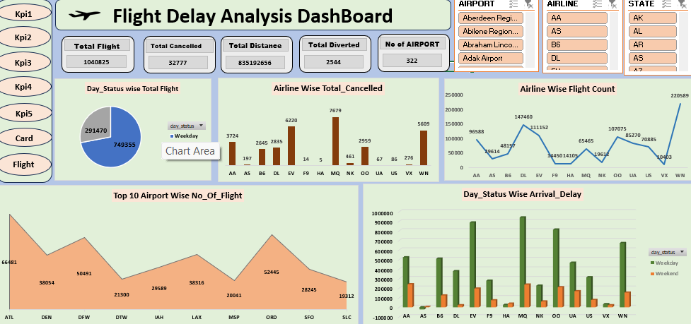

## 📥 Download Project Files

### 🔹 Excel Dashboard  
[Click Here to Download Excel Dashboard](https://docs.google.com/spreadsheets/d/1gv3cxBtGfS7SZqtGyHz3Hj-iOsegQorO/edit?usp=drive_link&ouid=118077615037092360815&rtpof=true&sd=true)

### 🔹 Power BI Report  
[Click Here to Download Power BI File](https://drive.google.com/file/d/15A9F0aRNxjB9T59hDq-2OCt9bjgngOxG/view?usp=drive_link)

### 🔹 Tableau Dashboard  
[Click Here to Download Tableau File](https://drive.google.com/file/d/1Y4FZqmM7sgrTFeWQ7TXSZF2Gk-BY5tYt/view?usp=drive_link)

### 🔹 SQL Queries  
[Click Here to Download SQL File](https://drive.google.com/file/d/1oyyVErPXQZdyBRvc1H_jJGgrSmAZyzNd/view?usp=drive_link)

### 🔹 Project Documentation  
[Click Here to Download Documentation](https://docs.google.com/document/d/1gvbqwYiL7N-ytAhIoOcvoRkYVorxSG1v/edit?usp=drive_link&ouid=118077615037092360815&rtpof=true&sd=true)

### 🔹 Project PPT  
[Click Here to Download PPT](https://docs.google.com/presentation/d/1XBHAQkOzVmoDkKTIt629XzOvn3gWPuW1/edit?usp=drive_link&ouid=118077615037092360815&rtpof=true&sd=true)

# 🔎 Project Overview
*Objective:* Analyze flight delays (distribution, airline-wise, weekday trends, cancellation & delay reasons) and provide interactive dashboards and reproducible SQL queries for KPI extraction.
This project helps airlines and airports identify delay patterns, optimize routes, 
and improve on-time performance using data-driven insights. 
The dashboard is designed for quick decision-making by operations teams.

*Dataset:* (briefly mention dataset source, e.g. “Public flight dataset—columns: FlightID, Airline, Date, Origin, Destination, DelayMinutes, Cancelled, Distance, ArrivalDelay, DepartureDelay”)

*Tools used:* Excel (Pivot, Power Query), Power BI, Tableau, SQL Google Drive (for large files)

## 📊 Dashboard Preview(excel)

### Power BI Preview
)

## 🚀 Key Features / Highlights
- Interactive Excel dashboard with slicers for Airline, Date range and Origin/Destination.  
- Power BI dashboard with visual breakdowns: airline performance, delays by weekday, top delayed routes.  
- Tableau workbook for geographic and time-series visualization.  
- Reusable SQL queries to compute KPIs: total flights, avg delay, % delays > 30 mins, cancellations.  
- Full project report documenting methodology, assumptions and business recommendations
  
 ## 📁 File Structure
  Flight-Delay-Analysis/
│
├── excel/
│   ├── flight_delay_excel.xlsx
│   └── excel_dashboard.png
│
├── powerbi/
│   ├── flight_delay.pbix
│   └── powerbi_dashboard.png
│
├── tableau/
│   ├── flight_delay.twbx
│   └── tableau_dashboard.png
│
├── sql/
│   └── queries.sql
│
├── documentation/
│   ├── project_report.pdf
│   └── project_presentation.pptx
│
└── README.md
   
## 🧠 Key Insights 
- Average delay: 22 minutes.  
- Worst-performing airline:Airline X (highest avg delay).  
- Peak delay day:Saturday (higher delays vs weekdays).

## 🛠️ Tools & Technologies Used
- Microsoft Excel (Pivot Tables, Power Query, Dashboard)
- Power BI (DAX, Data Modeling)
- Tableau (Geographical & Trend Visuals)
- SQL (Data Cleaning, KPI Queries)
-  Google Drive

- ## ▶️ How to Use This Project
1. Download the required project files from the links above.
2. Open the Excel file → go to the **Dashboard** sheet.
3. Use slicers to filter by Airline, Date, Route, Cancellation status.
4. For Power BI → open `.pbix` file and refresh the model if needed.
5. For SQL → open `queries.sql` and run KPIs one by one.
6. For Tableau → open `.twbx` file to explore maps and trends.

  ## 📞 Contact / Author
- Name: Mahesh Khandgave  
- LinkedIn:-[Click Here](https://www.linkedin.com/in/mahesh-khandgave-3457a4343/)
- Email: khandgavemahesh@gmail.com

  ## ⚠️ Data privacy & disclaimer
- This repository contains analysis derived from the provided dataset. No sensitive personal information is shared. If you need original raw data access, request permission.
  

  
