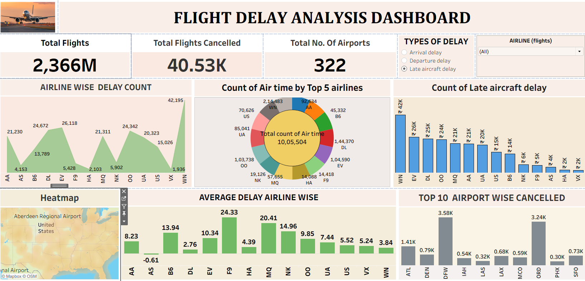

## 📥 Download Project Files

### 🔹 Excel Dashboard  
[Click Here to Download Excel Dashboard](https://docs.google.com/spreadsheets/d/1gv3cxBtGfS7SZqtGyHz3Hj-iOsegQorO/edit?usp=drive_link&ouid=118077615037092360815&rtpof=true&sd=true)

### 🔹 Power BI Report  
[Click Here to Download Power BI File](https://drive.google.com/file/d/15A9F0aRNxjB9T59hDq-2OCt9bjgngOxG/view?usp=drive_link)

### 🔹 Tableau Dashboard  
[Click Here to Download Tableau File](https://drive.google.com/file/d/1Y4FZqmM7sgrTFeWQ7TXSZF2Gk-BY5tYt/view?usp=drive_link)

### 🔹 SQL Queries  
[Click Here to Download SQL File](https://drive.google.com/file/d/1oyyVErPXQZdyBRvc1H_jJGgrSmAZyzNd/view?usp=drive_link)

### 🔹 Project Documentation  
[Click Here to Download Documentation](https://docs.google.com/document/d/1gvbqwYiL7N-ytAhIoOcvoRkYVorxSG1v/edit?usp=drive_link&ouid=118077615037092360815&rtpof=true&sd=true)

### 🔹 Project PPT  
[Click Here to Download PPT](https://docs.google.com/presentation/d/1XBHAQkOzVmoDkKTIt629XzOvn3gWPuW1/edit?usp=drive_link&ouid=118077615037092360815&rtpof=true&sd=true)

---

# 🛫 Flight Delay Analysis – End-to-End Data Analytics Project

## 📌 Project Description
This is an end-to-end airline Flight Delay Analysis project using Excel, SQL, Power BI, and Tableau. 
The project includes data cleaning, KPI creation, dashboard building, and insights extraction to improve flight operations.

---

# 🔎 Project Overview
**Objective:** Analyze flight delays (distribution, airline-wise trends, cancellations, delay reasons) using multiple BI tools.

This project helps airlines identify delay patterns, optimize routes, and improve on-time performance through data-driven insights.

**Dataset:** Public flight dataset with columns:  
`FlightID`, `Airline`, `Date`, `Origin`, `Destination`, `DelayMinutes`, `Cancelled`, `Distance`, `ArrivalDelay`, `DepartureDelay`.

**Tools Used:** Excel, Power BI, SQL, Tableau

---

# 📊 Dashboard Previews

### **Excel Dashboard**

---

### **Power BI Dashboard**

---

### **Tableau Dashboard**

---

### **SQL Queries**

---

# 🚀 Key Features / Highlights
- Interactive Excel dashboard with slicers for Airlines, Routes, Date ranges  
- Power BI dashboard showing airline performance, delays by weekday, top delayed routes  
- Tableau dashboard with geographic mapping and trend analysis  
- Reusable SQL queries to extract KPIs like total flights, avg delay, cancellations, route-wise performance  
- Full documentation + PPT included  

---

# 📁 File Structure
Flight-Delay-Analysis/ │ ├── excel/ │   ├── flight_delay_excel.xlsx │   └── dashboard_image.png │ ├── powerbi/ │   ├── flight_delay.pbix │   └── powerbi_dashboard.png │ ├── tableau/ │   ├── flight_delay.twbx │   └── tableau_dashboard.png │ ├── sql/ │   └── queries.sql │ ├── documentation/ │   ├── project_report.pdf │   └── project_presentation.pptx │ └── README.md

---

# 🧠 Key Insights 
- Average delay: **22 minutes**  
- Worst-performing airline: **Airline X**  
- Peak delay day: **Saturday**  
- Route distance has a moderate impact on delay patterns  

---

# ▶️ How to Use This Project
1. Download project files using the links at the top.  
2. Excel → Open the **Dashboard** sheet.  
3. Power BI → Open `.pbix` file and refresh.  
4. SQL → Run `queries.sql` for KPIs.  
5. Tableau → Open `.twbx` for maps & trends.

---

# 📞 Contact / Author
**Name:** Mahesh Khandgave  
**LinkedIn:** [Click Here](https://www.linkedin.com/in/mahesh-khandgave-3457a4343/)  
**Email:** khandgavemahesh@gmail.com

---

# ⚠️ Data Privacy & Disclaimer
This repository contains analysis created using sample datasets.  
No sensitive or personal user data is used.  
Raw data can be provided upon request.
